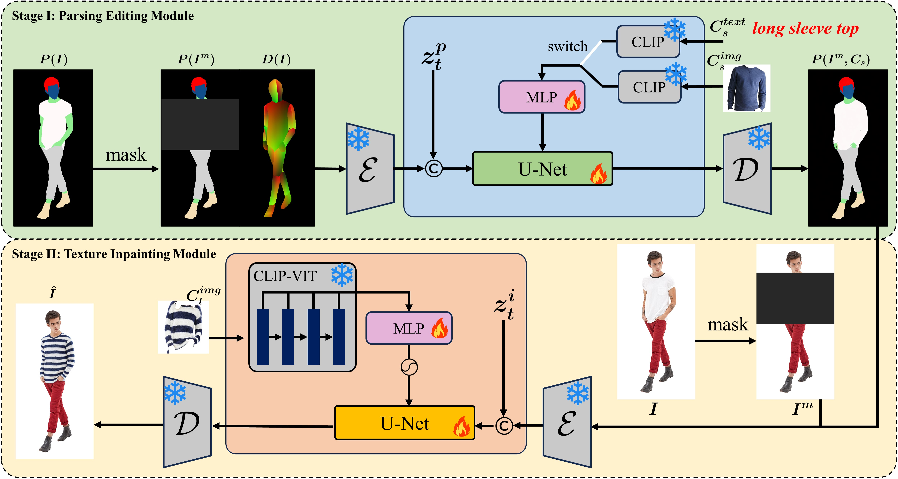
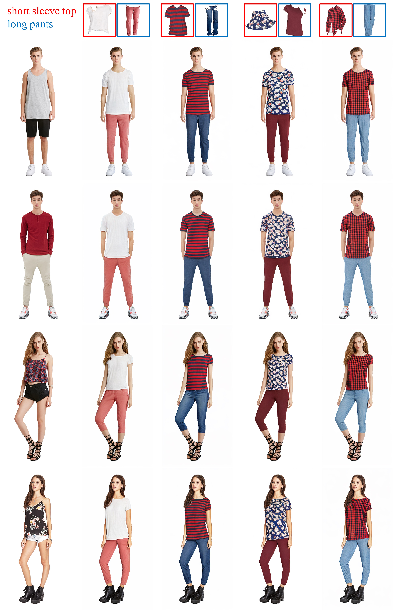
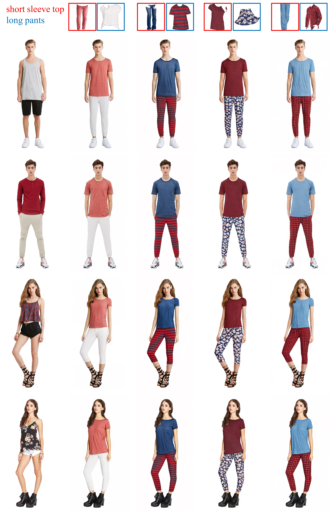
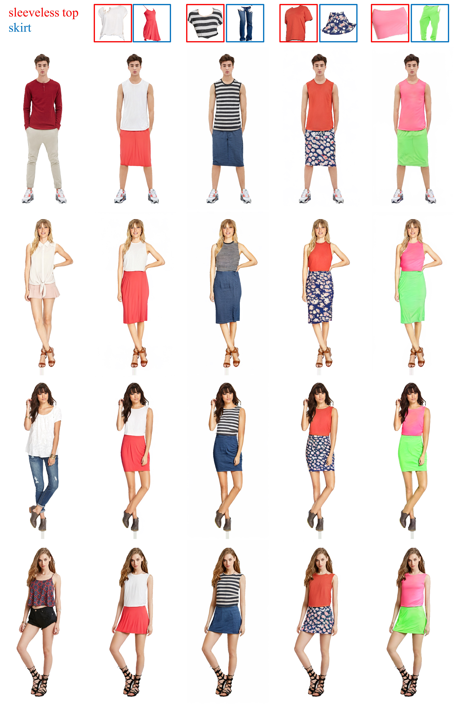
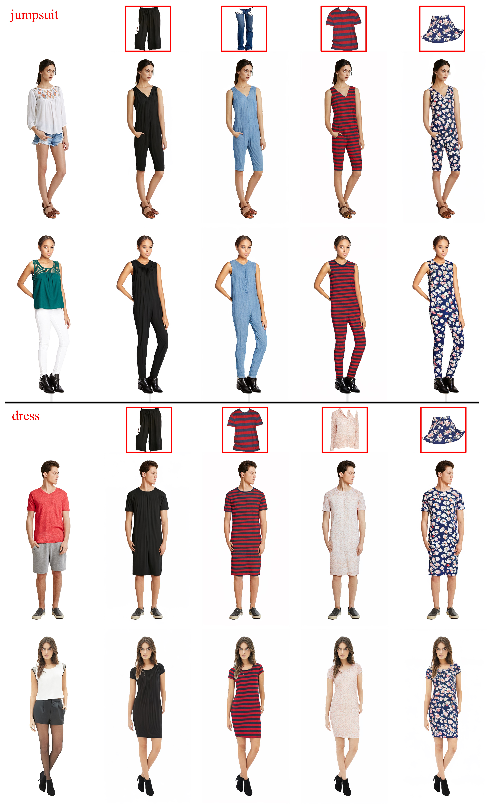

# PICTURE
PICTURE: PhotorealistIC virtual Try-on from UnconstRained dEsigns

[Shuliang Ning\*](https://ningshuliang.github.io/),
[Duomin Wang\](https://guanyingc.github.io/),
[Yipeng Qin\](https://profiles.cardiff.ac.uk/staff/qiny16),
[Zirong Jin\](https://scholar.google.com/citations?user=6-ARg6AAAAAJ&hl=en),
[Baoyuan Wang\](https://sites.google.com/site/zjuwby/),
[Xiaoguang Han\](https://gaplab.cuhk.edu.cn/)

<a href='https://ningshuliang.github.io/2023/Arxiv/index.html'></a> <a href='https://arxiv.org/abs/2312.04534'></a> [](https://www.youtube.com/watch?v=nEqVbkl2yY0)


<!-- ## TODO :triangular_flag_on_post:
- [ ] Provide the generation trial on [ModelScope's 3D Object Generation](https://modelscope.cn/studios/Damo_XR_Lab/3D_AIGC/summary)

- [ ] Text to ND Diffusion Model

- [ ] Multiview-ND and Multiview-Albedo Diffusion Models

- [ ] Release code (The code will be public around the end of Dec.2023.) -->

  

## Architecture


## Experiments










<!-- ## Citation	

```
@article{qiu2023richdreamer,
    title={RichDreamer: A Generalizable Normal-Depth Diffusion Model for Detail Richness in Text-to-3D}, 
    author={Lingteng Qiu and Guanying Chen and Xiaodong Gu and Qi zuo and Mutian Xu and Yushuang Wu and Weihao Yuan and Zilong Dong and Liefeng Bo and Xiaoguang Han},
    year={2023},
    journal = {arXiv preprint arXiv:2311.16918}
}
``` -->

